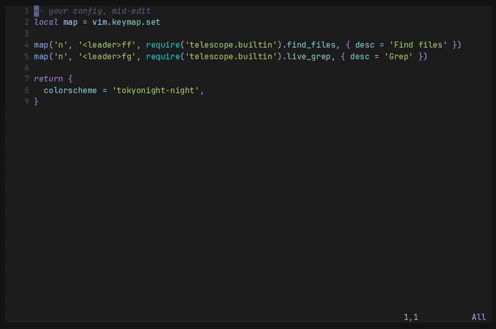

# ai-agents.nvim

One picker for every AI coding agent in Neovim, and one pair of mappings to
approve or reject what they propose.

Neovim can already talk to Claude Code, OpenAI Codex, GitHub Copilot, Gemini CLI
and a dozen API models — but through two different plugins, with different
commands, and with no way to tell which of them are actually installed until one
fails. This plugin puts them behind a single list.



## What it does

- **One picker (`<leader>ip`)** listing every agent and model available to you,
  usable ones first, with the missing binary named for the rest.
- **One pair of approve/reject mappings (`<leader>ia` / `<leader>id`) for every
  agent.** Claude Code answers to `:ClaudeCodeDiffAccept`, and only while the
  cursor sits in the proposed buffer; every ACP agent and model CodeCompanion
  drives answers to a keymap bound inside its own diff. These mappings find
  whichever diff is on screen, jump to it, and resolve it.
- **Show or hide the session (`<leader>it`)** without starting a second one.
- **Finds a `$HOME`-local Claude CLI.** Started outside a login shell, Neovim
  often cannot see `~/.local/bin/claude` and claudecode.nvim fails with
  `'claude' is not executable`. The absolute path is resolved instead.
- **Readable diffs.** Proposed changes open in their own tab rather than being
  squeezed between a file tree and a terminal.
- **`:checkhealth ai_agents`** tells you which agents are ready, which are
  missing, and how to install them.

## Two kinds of provider

|  | What it is | What you get |
|---|---|---|
| **ACP agent** | An external CLI driven over the [Agent Client Protocol](https://agentclientprotocol.com) | The agent edits files and you approve each change in a diff |
| **HTTP model** | An API provider (OpenAI, Anthropic, Gemini, Ollama, …) | Chat and inline edits |

ACP agents need their CLI installed; HTTP models need an API key.

## Requirements

- Neovim >= 0.10
- [claudecode.nvim](https://github.com/coder/claudecode.nvim) — for Claude Code
- [codecompanion.nvim](https://github.com/olimorris/codecompanion.nvim) — for every other provider

Both are pulled in automatically by the install below. At least one agent CLI or
API key of your own, obviously.

## Installation

With [lazy.nvim](https://github.com/folke/lazy.nvim):

```lua
{ "tw4/ai-agents.nvim" }
```

That is the whole install. Dependencies are pulled in and configured, the
mappings below work, and nothing loads until you first use it.

To pin a release:

```lua
{ "tw4/ai-agents.nvim", version = "*" }
```

To change the mappings, override `keys` as you would for any lazy.nvim plugin:

```lua
{
  "tw4/ai-agents.nvim",
  keys = {
    { "<leader>ap", "<cmd>AiAgents<cr>", desc = "Pick AI provider" },
    { "<leader>at", "<cmd>AiAgentsToggle<cr>", desc = "Show or hide the session" },
    { "<leader>aa", "<cmd>AiAgentsAccept<cr>", desc = "Accept proposed changes" },
    { "<leader>ad", "<cmd>AiAgentsDeny<cr>", desc = "Reject proposed changes" },
  },
}
```

With another plugin manager, install `coder/claudecode.nvim` and
`olimorris/codecompanion.nvim` alongside it, then call
`require("ai_agents").setup()` — that registers the default mappings itself, and
`require("ai_agents").claude_opts()` returns the claudecode.nvim options
described above.

## Configuration

Defaults shown; pass only what you want to change.

```lua
require("ai_agents").setup({
  -- Register the default keymaps. Set to false to map the commands yourself.
  keymaps = true,
  prefix = "<leader>i",

  -- Adapters that CodeCompanion ships for the @web_search tool rather than for
  -- chatting. Picking one fails confusingly, so they are hidden.
  exclude = { "jina", "tavily", "duckduckgo" },

  claude = {
    resolve_cmd = true,
    cmd_candidates = { "~/.local/bin/claude", "~/.claude/local/claude" },
  },
})
```

## Usage

| Mapping | Command | Action |
|---|---|---|
| `<leader>ip` | `:AiAgents` | Pick a provider and open a session |
| `<leader>it` | `:AiAgentsToggle` | Show or hide the session |
| `<leader>ia` | `:AiAgentsAccept` | Accept the proposed changes |
| `<leader>id` | `:AiAgentsDeny` | Reject the proposed changes |

You can edit the proposed buffer before accepting — what you accept is what you
see, not what the agent originally wrote.

### Getting the agents

| Provider | Install |
|---|---|
| Claude Code | `curl -fsSL https://claude.ai/install.sh \| bash` |
| OpenAI Codex | the `codex` CLI, plus `npm i -g @agentclientprotocol/codex-acp` |
| GitHub Copilot | `npm i -g @github/copilot` |
| opencode | `npm i -g opencode-ai` |
| Gemini CLI | `npm i -g @google/gemini-cli` |

Run `:checkhealth ai_agents` to see where you stand.

### Why Claude Code is not routed through ACP

CodeCompanion can drive Claude Code over ACP, but claudecode.nvim speaks
Claude's own IDE protocol — the same one the VS Code and JetBrains extensions
use — which gives a better diff. So `claude-code` in the picker goes through
claudecode.nvim, and the `claude_code` ACP entry is left alone.

## Credits

- [claudecode.nvim](https://github.com/coder/claudecode.nvim) by Coder
- [codecompanion.nvim](https://github.com/olimorris/codecompanion.nvim) by Oli Morris
- Grew out of a [kickstart.nvim](https://github.com/nvim-lua/kickstart.nvim) config

## License

MIT
